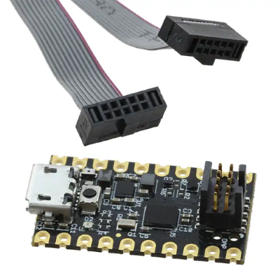
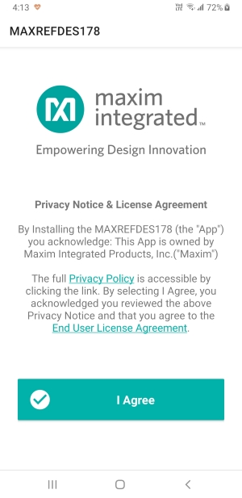
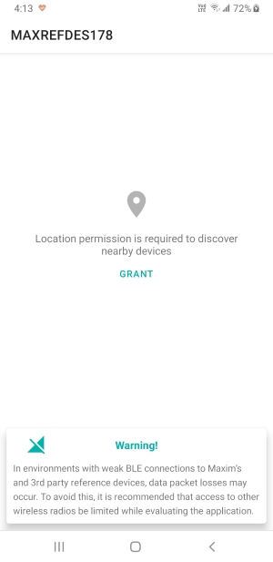
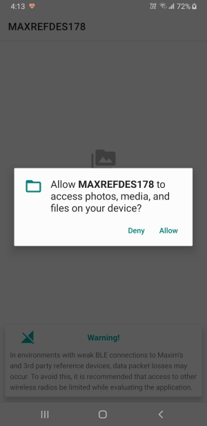
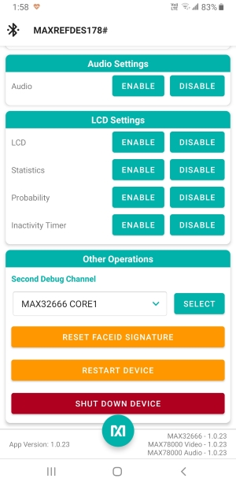
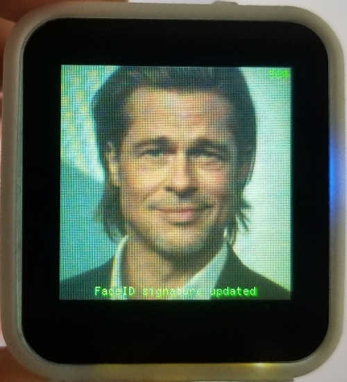
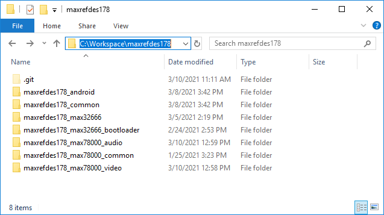
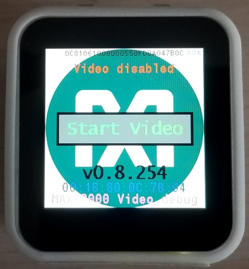
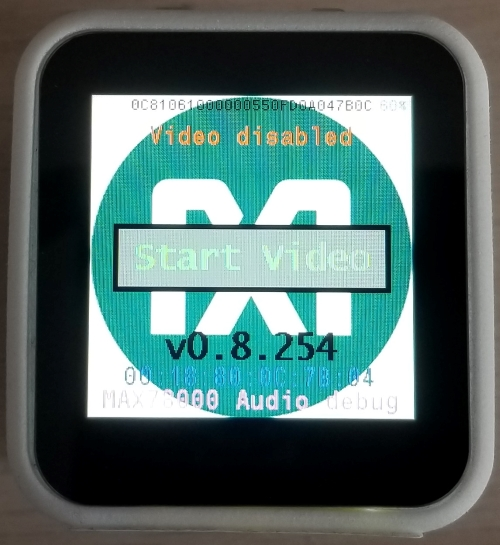

# Getting Started with the MAXREFDES178# Cube Camera

## List of MAXREFDES178# Components

Before beginning, make sure you have all of the following components.

  * MAXREFDES178# Cube Camera with enclosure.

    Front - Right Side (LCD, USB-C Socket, SD Card Socket) | Back - Left Side (Camera, Audio Jacks) 
    :-------------------------:|:-------------------------:
     |  

  * MAXDAP-TYPE-C Pico adaptor.

    

  * MAX32625PICO Debugger with ribbon SWD cable.

    

  * 2 x USB-A to USB-Micro-B cables.

    

  * USB-A to USB-C cable.

    

  * Android Device. 


## Schematic

The schematic and BOM can be found in the MAXREFDES178# Datasheet.  See https://www.maximintegrated.com/products/MAXREFDES178

## Powering the MAXREFDES178# for the First Time

The MAXREFDES178# comes with a preloaded demo application.

### MAXREFDES178# Demo Firmware

- Plug a USB-C cable to charge the device.

- Press power button for 1 seconds to turn on the device.

- Power LED will start blinking blue.

- Maxim logo, BLE MAC, serial number and firmware version will appear on the LCD.
  
  

- Device will start with:

  - Video and FaceID disabled state.
  - Audio and KWS20 (keyword spotting) enabled state.

- KWS20 classification results will appear on top of the LCD.

  - KWS20 keywords are: ['up', 'down', 'left', 'right', 'stop', 'go', 'yes', 'no', 'on', 'off', 'one', 'two', 'three', 'four', 'five', 'six', 'seven', 'eight', 'nine', 'zero'].
  - KWS20 classification result text changes color according to KWS20 classification confidence:
    - Red → Unknown keyword
    - Yellow → Keyword detected with low confidence
    - Green → Keyword detected with high confidence
  
    

- 'On' & 'Off' voice commands (high confidence) enables & disables LCD.

- Click "Start Video" button on LCD to start video capturing.

- 'Go' & 'Stop' voice commands (high confidence) enables & disables FaceID.

- FaceID frame appears in the center of the LCD when FaceID is enabled.
  
  FaceID Disabled | FaceID Enabled
  :-------------------------:|:-------------------------:
   |  

- FaceID classification results appear on bottom of the LCD.

  - Celebrity FaceID database is the default FaceID database.
  - Celebrity FaceID database subjects are: ['AshtonKutcher', 'BradPitt', 'CharlizeTheron', 'ChrisHemsworth', 'MilaKunis', 'ScarlettJohansson']
  - FaceID classification result text, FaceID frame and Video LED (LED A) changes color according to FaceID classification confidence:
    - Red → Unknown subject
    - Yellow → Subject detected with low confidence
    - Green → Subject detected with high confidence
  - Point camera to any celebrity photo and center FaceID frame to celebrity's face.

- Battery state of charge (SOC) is shown right top corner of the LCD. SOC changes color according to charge state:

  - Red → SOC is below 10%.
  - Green → SOC is above 10%.
  - Orange → USB-C is connected and battery is charging.

- Button behavior:

  

  - Short press (1 second) on power button disables video and navigates to startup screen.
  - Long press (4 seconds) on power button turns off the device.
  - Button X enables & disables device statistics on LCD. Device statistics are:
    - LCD frame per second.
    - FaceID duration (MAX78000 Video CNN + embeddings calculation) in millisecond.
    - KWS20 duration (MAX78000 Audio CNN) in microsecond.
    - Video camera (frame) capture duration in millisecond.
    - Video communication duration (frame transfer from MAX78000 to MAX32666 over QSPI).
    - MAX78000 Video power in milliwatt.
    - MAX78000 Audio power in milliwatt.
    - FaceID embeddings database subject names.
    
      
    
  - Button Y changes second debug channel target of Type-C connector. Second debug channel targets are:
    - MAX32666 Core1
    - MAX78000 Video
    - MAX78000 Audio
  - Button A enables/disables video Flash LED.
  - Button B is unused.
  
- If inactivity timer is enabled (enabled by default):

  - After 1 minute of inactivity, LCD backlight is dim automatically.
  - After 2 minutes of inactivity, LCD and MAX78000 Video are disabled automatically.
  - Inactivity timer is reset when:
    - Motion (accelerometer) is detected.
    - KWS20 classification is detected.
    - FaceID classification is detected.
    - Any button is pressed.
    - LCD is touched.
    - USB connection event.
    - BLE connection event or any BLE command is received.

- Power LED turns solid blue when BLE peer is connected.

### MAXREFDES178# Demo Android Application

Remaining steps requires an Android device. Currently, ARM 64 Bits (arm64-v8a) devices and Android version between 7 to 10 are supported.

- Install MAXREFDES178# Android application from: TODO

- Enable BLE on Android device.

- Open MAXREFDES178# Android application. Accept license agreement and grant required accesses if you are using the app first time.
  
    
  
- Select your MAXREFDES178# BLE MAC address on BLE scan page to connect to MAXREFDES178#. You can find your device BLE MAC address by short pressing (1 second) on power button.
  
  
  
- Connected MAXREFDES178# device firmware version will be shown right left corner.
  
  

#### Change MAXREFDES178# demo settings using Android Application

- Navigate to settings page to change demo settings.
- Video capture can be enabled & disabled.
- FaceID can be enabled & disabled.
- Video capture vertical flip for selfie adaptor can be enabled & disabled.
- Video flash LED can be enabled & disabled.
- Camera clock can be set to 5 MHz, 10 MHz, or 15 MHz. 
- Audio (KWS20) can be enabled & disabled.
- LCD can be enabled & disabled.
- Device statistics on LCD can be enabled & disabled.
- KWS20 classification probability on LCD can be enabled & disabled.
- Inactivity timer can be enabled & disabled.
- Second debug channel target can be changed.
- Device can be restarted. (Requests user approval)
- Device can be shut down. (Requests user approval)
  
   

#### Generate and upload new FaceID database to MAXREFDES178# using Android Application

- Navigate to FaceID page.

- Click '+' icon on right bottom corner to create a new FaceID database.
  
   

- Click '+' icon on right bottom corner to add new person (subject) to the database.
  
  - Maximum 6 subjects is allowed.
  
- Click '+' icon on under subject name to add new face photo to subject.
  - Photos can be added from camera or from file system.
  - Photos can be cropped.
  - Maximum 8 photos is allowed.
  
   

- Click 'INFO' button on right top corner for more information about FaceID photo guidelines.
  
   

- When you complete adding new subjects and photos, click 'GENERATE/UPLOAD SIGNATURE' button to generate & upload new FaceID signatures to the connected MAXREFDES178#.
  
   

- Click 'GENERATE SIGNATURE' button to generate signature from the database.
  
    

- Click 'UPLOAD SIGNATURE' button to upload FaceID signature to the MAXREFDES178#.
  
  

- A notification on MAXREFDES178# will appear if signature update is successful.
  
  

## Build Demo Firmware using MINGW on Windows

### Install Maxim SDK

You'll need to download and install the Maxim SDK onto a Windows 10 host.  The Maxim SDK is available here:

https://www.maximintegrated.com/content/maximintegrated/en/design/software-description.html/swpart=SFW0010820A

On Windows, the MSYS shell (included in the SDK) can be used to build examples.  Start 'msys.bat' to launch the shell.  The shell can be accessed from the Windows Start Menu or in the default installation directory show below.


### Download MAXREFDES178# Demo Repo

Download MAXREFDES178# from GitHub repo:

```
 git clone TODO link here
```



**WARNING:** Put MAXREFDES178# directory close to the main drive. (i.e. C:\Workspace\\) Long Windows paths may cause build to fail.

Repo folder structure:

- maxrefdes178_android:
  - Android application source files.
  - Android Studio project files.
- maxrefdes178_common:
  - MAX32666, MAX78000 Video and MAX78000 Audio firmware common headers and source files.
- maxrefdes178_max32666:
  - MAX32666 firmware source files.
  - MAX32666 firmware Eclipse project files.
- maxrefdes178_max32666_bootloader:
  - MAX32666 bootloader firmware  source files.
  - MAX32666 bootloader firmware Eclipse project files.
- maxrefdes178_max78000_common:
  - MAX78000 Video and MAX78000 Audio firmware common headers and source files.
- maxrefdes178_max78000_audio:
  - MAX78000 Audio firmware source files.
  - MAX78000 Audio firmware Eclipse project files.
- maxrefdes178_max78000_video:
  - MAX78000 Video firmware source files.
  - MAX78000 Video firmware Eclipse project files.

### Build MAXREFDES178# Demo Firmware

#### Build MAX32666 Firmware

- Open MinGW MSYS shell.

- cd into maxrefdes178_max32666 directory.

- Run make.
  ```
  make -r -j 4
  ```
  
  

- maxrefdes178_max32666\build\maxrefdes178_max32666.bin firmware binary should be generated.

#### Build MAX78000 Audio Firmware

- Open MinGW MSYS shell.
- cd into maxrefdes178_max78000_audio directory.
- Run make.
  ```
  make -r -j 4
  ```
  
  

- maxrefdes178_max78000_audio\build\maxrefdes178_max78000_audio.bin firmware binary should be generated.

#### Build MAX78000 Video Firmware

- Open MinGW MSYS shell.
- cd into maxrefdes178_max78000_video directory.
- Run make.
  ```
  make -r -j 4
  ```
  
  

- maxrefdes178_max78000_video\build\maxrefdes178_max78000_video.bin firmware binary should be generated.

### Build MAXREFDES178# Demo Android Application

- Download and install Android Studio. https://developer.android.com/studio

- Install Android 9 Android SDK from Android Studio SDK manager.

- Click File->Open and select maxrefdes178\maxrefdes178_android directory.

- Build the project.

  **Warning:** MAXREFDES178# Android Application uses Chaquopy Python SDK for running Python scripts. Chaquopy requires License for commercial uses.

## Load Demo Firmware using MINGW on Windows

**WARNING:** If you are programming a board that already has MAX78000 Video and MAX78000 Audio firmware, make sure video (FaceID) and audio (KWS) are enabled and running. Start programming MAX78000 Video and MAX78000 Audio firmware first, then MAX32666. MAX78000 Video and MAX78000 Audio firmware goes to sleep mode when they are disabled, which causes interruption during programming.

- Applications are loaded and run using OpenOCD.  This section shows how to do this specifically with MSYS on Windows.

- Open MinGW console and cd into MAXREFDES178# directory.
  
  

- Connect a USB-Micro-B cable to MAXDAP-TYPE-C Pico adaptor HDK debugger (Pico) port. The Pico on the adaptor must be programmed with  [max32625pico_max32630hsp.bin](https://os.mbed.com/teams/MaximIntegrated/wiki/MAX32625PICO-Firmware-Updates) DAPLINK image.

  

### Load MAX32666 Firmware

- Insert MAXDAP-TYPE-C Pico adaptor board to MAXREFDES178# MAX32666 (first debug channel). MAXDAP-TYPE-C Pico adaptor and MAXREFDES178# LCD should face to opposite direction:
  
  

- Program MAX32666 firmware:

  ```bash
  openocd -s ${TOOLCHAIN_PATH}/OpenOCD/scripts -f interface/cmsis-dap.cfg -f target/max32665_nsrst.cfg -c "init;halt;max32xxx mass_erase 0;exit"
  openocd -s ${TOOLCHAIN_PATH}/OpenOCD/scripts -f interface/cmsis-dap.cfg -f target/max32665_nsrst.cfg -c "program maxrefdes178_max32666/build/maxrefdes178_max32666.bin verify reset exit 0x10000000"
  ```
  
- Successful MAX32666 firmware update output:
  
  

- Press Y button to change second debug channel to either MAX78000 Video or MAX78000 Audio.

- A notification at the bottom of the LCD will show the selected target.

MAX78000 Video Debug Select | MAX78000 Audio Debug Select 
:-------------------------:|:-------------------------:
 |  

### Load MAX78000 Video Firmware

- **WARNING:** If you are programming a board that already has MAX78000 Video firmware, make sure video (FaceID) is enabled and running. MAX78000 Video firmware goes to sleep mode when they are disabled, which causes interruption during programming.

- MAX32666 firmware should be loaded before this step.

- Insert MAXDAP-TYPE-C Pico adaptor board to MAXREFDES178# second debug channel. MAXDAP-TYPE-C Pico adaptor and MAXREFDES178# LCD should face to same direction.
  
  

- Select MAX78000 Video target with button Y. MAX78000 Video will disable sleep mode for 30 seconds to prevent interruption during programming. Be quick after selecting target with button Y.

- Program MAX78000 Video firmware:
  ```bash
  openocd -s ${TOOLCHAIN_PATH}/OpenOCD/scripts -f interface/cmsis-dap.cfg -f target/max78000_nsrst.cfg -c "program maxrefdes178_max78000_video/build/maxrefdes178_max78000_video.bin verify reset exit 0x10000000"
  ```
  
- Successful MAX78000 Video firmware update output:
  
  

### Load MAX78000 Audio Firmware

- MAX32666 firmware should be loaded before this step.

- Insert MAXDAP-TYPE-C Pico adaptor board to MAXREFDES178# second debug channel. MAXDAP-TYPE-C Pico adaptor and MAXREFDES178# LCD should face to same direction:
  
  

- Select MAX78000 Audio target with button Y. MAX78000 Audio will disable sleep mode for 30 seconds to prevent interruption during programming. Be quick after selecting target with button Y.

- Program MAX78000 Audio firmware:
  ```bash
  openocd -s ${TOOLCHAIN_PATH}/OpenOCD/scripts -f interface/cmsis-dap.cfg -f target/max78000_nsrst.cfg -c "program maxrefdes178_max78000_audio/build/maxrefdes178_max78000_audio.bin verify reset exit 0x10000000"
  ```
  
- Successful MAX78000 Audio firmware update output:
  
  

## Debug Demo Firmware using MINGW on Windows

- Applications are loaded, debugged, and run using OpenOCD and GDB.  This section shows how to do this specifically with MSYS on Windows.
- First we need to connect to the target with OpenOCD, then we can debug the target with GDB.
- Open MinGW console and cd into MAXREFDES178# codebase directory.
  
  

### Connect to MAX32666 with OpenOCD

- Insert MAXDAP-TYPE-C Pico adaptor board to MAXREFDES178# MAX32666 (first debug channel). MAXDAP-TYPE-C Pico adaptor and MAXREFDES178# LCD should face to opposite direction:
  
  
  
- Start OpenOCD for MAX32666:

  ```bash
  openocd -s ${TOOLCHAIN_PATH}/OpenOCD/scripts -f interface/cmsis-dap.cfg -f target/max32665_nsrst.cfg
  ```

- On successful connection, you will see messages as shown below.
  
  

### Connect to MAX78000s with OpenOCD

- Insert MAXDAP-TYPE-C Pico adaptor board to MAXREFDES178# second debug channel. MAXDAP-TYPE-C Pico adaptor and MAXREFDES178# LCD should face to same direction:
  
  

- Select MAX78000 Audio or MAX78000 Video target with button Y.

- Start OpenOCD for MAX78000:

  ```bash
  openocd -s ${TOOLCHAIN_PATH}/OpenOCD/scripts -f interface/cmsis-dap.cfg -f target/max78000_nsrst.cfg
  ```

- On successful connection, you will see messages as shown below.
  
  

### Debug Target with GDB

- Open another MinGW console and cd into MAXREFDES178# codebase directory.

- Launch GDB using one of the following commands:

  ```bash
  arm-none-eabi-gdb maxrefdes178_max32666/build/maxrefdes178_max32666.elf
  arm-none-eabi-gdb maxrefdes178_max78000_video/build/maxrefdes178_max78000_video.elf
  arm-none-eabi-gdb maxrefdes178_max78000_audio/build/maxrefdes178_max78000_audio.elf
  ```
  
  

- Connect GDB to OpenOCD and reset the target.

  ```bash
  target remote localhost:3333
  monitor reset halt
  ```

- Load and verify the application.

  ```bash
  load
  compare-sections
  ```

- Reset the device and run the application:

  ```bash
  monitor reset halt
  c
  ```

## Debugging Applications with GDB

Follow the same steps provided in the *Loading and Running Applications on the EV Kit* section. While the application is running, use \<CTRL-C\> to interrupt the application and halt its execution. The table below lists a few of the commands available to you any time the application is halted.

| **Command**                    | **Short Command** | **Description**                                              |
| ------------------------------ | ----------------- | ------------------------------------------------------------ |
| monitor halt                   |                   | Halt the microcontroller.                                    |
| monitor reset halt             |                   | Reset the microcontroller and immediately halt.              |
| monitor max32xxx mass\_erase 0 |                   | Mass erase the flash.                                        |
| continue                       | c                 | Continue execution.                                          |
| break \<arg\>                  | b \<arg\>         | Set a breakpoint. Argument can be function\_name, file:line\_number, or \*address. |
| print \<variable\>             | p                 | Print the value of a variable. Variable must be in current scope. |
| backtrace                      | bt                | Print contents of the stack frame.                           |
| step                           | s                 | Execute the next instruction.                                |
| next                           | n                 | Execute the next line of code.                               |
| finish                         | f                 | Continue to the end of the current function.                 |
| info reg                       |                   | Print the values of the ARM registers.                       |
| help                           |                   | Print descriptions for available commands                    |
| help \<cmd\>                   |                   | Print description for given command.                         |

## Build and Debug Demo Firmware using Eclipse on Windows

TODO

