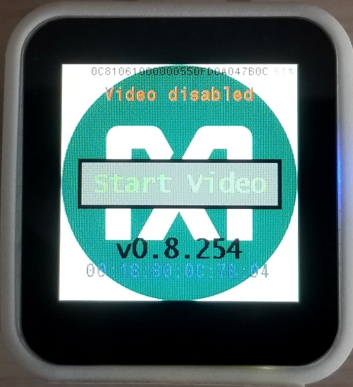
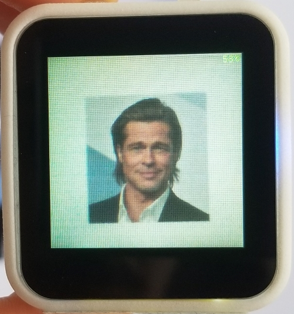
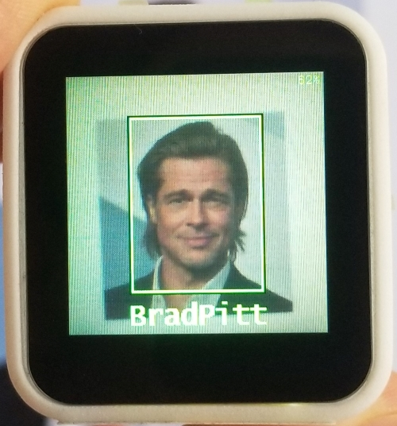
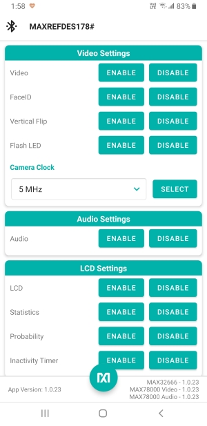
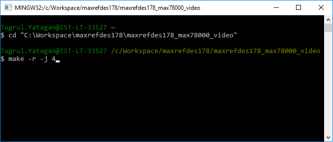
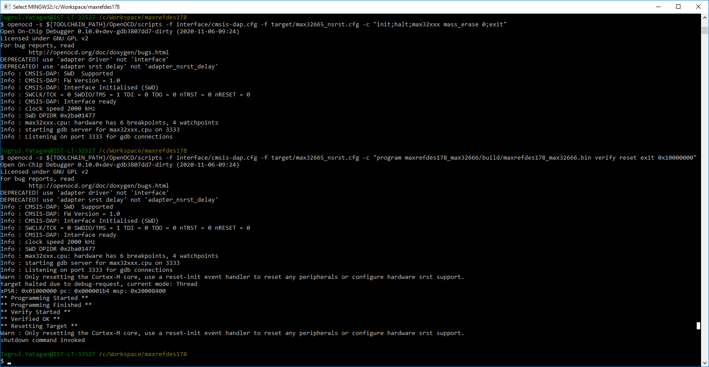
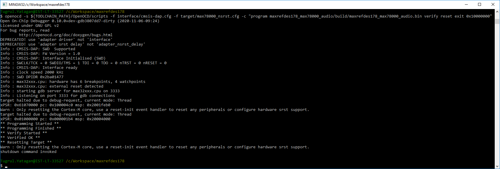
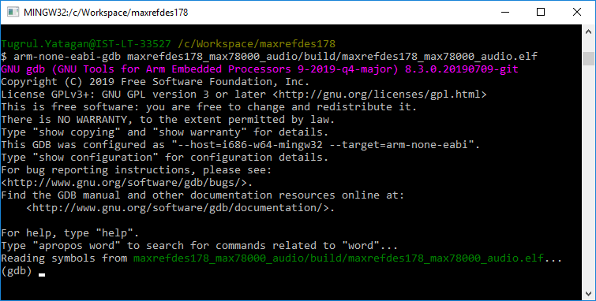

# Getting Started with the MAXREFDES178# Cube Camera

## List of MAXREFDES178# Components

Before you begin, make sure you have all of the following components:

  * MAXREFDES178# Cube Camera with enclosure.

    Front - Right Side (LCD, USB-C Socket, SD Card Socket) | Back - Left Side (Camera, Audio Jacks) 
    :-------------------------:|:-------------------------:
     |  

  * MAXDAP-TYPE-C Pico adaptor.

    

  * MAX32625PICO Debugger with ribbon SWD cable.

    

  * 2 x USB-A to USB-Micro-B cables.

    

  * USB-A to USB-C cable.

    

  * Android Device. 


## Schematic

The schematic and BOM can be found in the MAXREFDES178# Datasheet. See https://www.maximintegrated.com/products/MAXREFDES178

## Powering Up the MAXREFDES178# for the First Time

The MAXREFDES178# comes with a preloaded demo application.

[](https://github.com/MaximIntegratedAI/refdes/actions/workflows/maxrefdes178.yml)

### MAXREFDES178# Demo Firmware

- *Some* units have a protective film installed covering the camera. Remove the film:

  

- Plug in a USB-C cable to charge the device.

- Press the power button for one second to turn on the device.

- The power LED will start blinking blue.

- The Maxim logo, BLE MAC, serial number and firmware version will appear on the LCD.
  
  

- The device will start with:

  - Video and FaceID in disabled state.
  - Audio and KWS20 (keyword spotting) in enabled state.

- KWS20 classification results will appear on top of the LCD.

  - KWS20 keywords are: [‘up’, ‘down’, ‘left’, ‘right’, ‘stop’, ‘go’, ‘yes’, ‘no’, ‘on’, ‘off’, ‘one’, ‘two’, ‘three’, ‘four’, ‘five’, ‘six’, ‘seven’, ‘eight’, ‘nine’, ‘zero’].
  - The KWS20 classification result text changes color according to the KWS20 classification confidence:
    - Red → Unknown keyword
    - Yellow → Keyword detected with low confidence
    - Green → Keyword detected with high confidence
  
    

- The ‘On’ & ‘Off’ voice commands (when recognized with high confidence) enable / disable the LCD.

- Touch the “Start Video” button on the LCD to start video capture.

- The ‘Go’ and ‘Stop’ voice commands (when recognized with high confidence) enable / disable FaceID.

- The FaceID frame appears in the center of the LCD when FaceID is enabled:
  
  FaceID Disabled | FaceID Enabled
  :-------------------------:|:-------------------------:
   |  

- FaceID classification results appear on bottom of the LCD.

  - The Celebrity FaceID database is the default FaceID database.
  - Celebrity FaceID database subjects are: [‘AshtonKutcher’, ‘BradPitt’, ‘CharlizeTheron’, ‘ChrisHemsworth’, ‘MilaKunis’, ‘ScarlettJohansson’]
  - FaceID classification result text, FaceID frame and Video LED (LED A) change color according to FaceID classification confidence:
    - Red → Unknown subject
    - Yellow → Subject detected with low confidence
    - Green → Subject detected with high confidence
  - Point the camera to any celebrity photo and center the FaceID frame to celebrity’s face.

- The battery state of charge (SOC) is shown right top corner of the LCD. SOC changes color according to charge state:

  - Red → SOC is below 10%.
  - Green → SOC is above 10%.
  - Orange → USB-C is connected and battery is charging.

- Button behavior:

  

  - A short press (1 second) on power button disables video and navigates to startup screen.
  - A long press (4 seconds) on power button turns off the device.
  - Button X enables / disables device statistics on LCD. Device statistics are:
    - LCD frames per second.
    - FaceID duration (MAX78000 Video CNN + embedding calculation) in milliseconds.
    - KWS20 duration (MAX78000 Audio CNN) in microseconds.
    - Video camera (frame) capture duration in milliseconds.
    - Video communications duration (frame transfer from MAX78000 to MAX32666 over QSPI).
    - MAX78000 Video power consumption in milliwatts (V<sub>REGI</sub> + V<sub>COREA</sub> = Input supply + CNN active supply).
    - MAX78000 Audio power consumption in milliwatts (V<sub>REGI</sub> + V<sub>COREA</sub> = Input supply + CNN active supply).
    - FaceID embeddings database subject names:
    
      
    
  - Button Y changes the second debug channel target of the Type-C connector. Second debug channel targets are:
    - MAX32666 Core1
    - MAX78000 Video
    - MAX78000 Audio
  - Button A enables / disables the video Flash LED.
  - Button B is unused.
  
- If the inactivity timer is enabled (enabled by default):

  - After 1 minute of inactivity, LCD backlight is dimmed automatically.
  - After 2 minutes of inactivity, LCD and MAX78000 Video are disabled automatically.
  - The inactivity timer is reset when:
    - Motion is detected (using the accelerometer).
    - A KWS20 classification is detected.
    - A FaceID classification is detected.
    - Any button is pressed.
    - The LCD is touched.
    - When USB is connected.
    - When BLE is connected or any BLE command is received.

- The Power LED turns solid blue when a BLE peer is connected.

### MAXREFDES178# Demo Android Application

The remaining steps requires an Android device. Currently, ARM 64-bit devices and (arm64-v8a) Android versions from 7 to 11 are supported.

- Install the MAXREFDES178# Android application from Google Play: https://play.google.com/store/apps/details?id=com.maximintegrated.maxcamandroid

- Enable BLE on the Android device.

- Open the MAXREFDES178# Android application. Accept the license agreement and grant required access if you are using the app for the first time:
  
    
  
- Select your MAXREFDES178# BLE MAC address on the BLE scan page to connect to MAXREFDES178#. You can find your device BLE MAC address by short pressing (for 1 second) on the power button:
  
  
  
- The connected MAXREFDES178# device firmware version will be shown right left corner:
  
  

#### Change MAXREFDES178# demo settings using the Android Application

- Navigate to the settings page to change demo settings.

- Video capture can be enabled / disabled.

- FaceID can be enabled / disabled.

- Video capture vertical flip for selfie adaptor can be enabled / disabled.

- The video flash LED can be enabled / disabled.

- Camera clock can be set to 5 MHz, 10 MHz, or 15 MHz. 

- Audio (KWS20) can be enabled / disabled.

- The LCD can be enabled / disabled.

- Device statistics on LCD can be enabled / disabled.

- The KWS20 classification probability display on LCD can be enabled / disabled.

- The inactivity timer can be enabled / disabled.

- The second debug channel target can be changed.

- The FaceID signature can be reset to default (after user approval).

- The device can be restarted (after user approval).

- The device can be shut down (after user approval).
  
   

#### Generate and upload a new FaceID database to MAXREFDES178# using the Android Application

- Navigate to the FaceID page.

  

- Click the ‘+’ icon on the right bottom corner to create a new FaceID database:
  
   

- Click the ‘+’ icon on the right bottom corner to add a new person (subject) to the database.
  
  - A maximum of six subjects is allowed.

    
  
- Click the ‘+’ icon under the subject name to add a new face photo to the subject.
  - Photos can be added using the camera or from the file system.
  - Photos can be cropped.
  - A maximum of eight photos is allowed.
  
  

- Click the ‘INFO’ button on the top right corner for more information about FaceID photo guidelines.
  
   

- When you complete adding new subjects and photos, click the ‘GENERATE/UPLOAD SIGNATURE’ button to generate and upload new FaceID signatures to the connected MAXREFDES178#.
  
   

- Click the ‘GENERATE SIGNATURE’ button to generate a signature from the database.

  - Only the photos containing a face are included in the signature. Face detection result will be shown after signature is generated.
  
   

  - If face is detected in any photo, you can review the photos by pressing the previous page button.

  

  - Good/Bad photos will be indicated by :heavy_check_mark:/:x: marks in previous page.

  

- Click the ‘UPLOAD SIGNATURE’ button to upload a FaceID signature to the MAXREFDES178#. (after user approval)
  
   

- A notification on MAXREFDES178# will appear if the signature update is successful.
  
  

## Build Demo Firmware using MINGW on Windows

### Install Maxim SDK

You will need to download and install the Maxim SDK on a Windows 10 host. The Maxim SDK is available here:

https://www.maximintegrated.com/content/maximintegrated/en/design/software-description.html/swpart=SFW0010820A

On Windows, the MSYS shell (included in the SDK) can be used to build examples. Start `msys.bat` to launch the shell. The shell can be accessed from the Windows Start Menu or in the default installation directory show below:


### Download the MAXREFDES178# Demo Repo

Download MAXREFDES178# from GitHub with submodules:

```
 git clone --recurse-submodules git@github.com:MaximIntegratedAI/refdes.git
```


**WARNING:** **Put the MAXREFDES178# directory close to the root of the drive. Long Windows paths may cause failed builds.**

Repo folder structure:

- `maxrefdes178_android`:
  - Android application source files.
  - Android Studio project files.
- `maxrefdes178_common`:
  - MAX32666, MAX78000 Video and MAX78000 Audio firmware common headers and source files.
- `maxrefdes178_max32666`:
  - MAX32666 firmware source files.
  - MAX32666 firmware Eclipse project files.
- `maxrefdes178_max32666_bootloader`:
  - MAX32666 bootloader firmware source files.
  - MAX32666 bootloader firmware Eclipse project files.
- `maxrefdes178_max78000_common`:
  - MAX78000 Video and MAX78000 Audio firmware common headers and source files.
- `maxrefdes178_max78000_audio`:
  - MAX78000 Audio firmware source files.
  - MAX78000 Audio firmware Eclipse project files.
- `maxrefdes178_max78000_video`:
  - MAX78000 Video firmware source files.
  - MAX78000 Video firmware Eclipse project files.

### Build MAXREFDES178# Demo Firmware

#### Build MAX32666 Firmware

- Open MinGW MSYS shell.

- cd into the `maxrefdes178_max32666` directory.

- Run make:
  ```
  make -r -j 4
  ```
  
  

- A `maxrefdes178_max32666\build\maxrefdes178_max32666.bin` firmware binary should be generated.

**WARNING:** I**f you get the following error during build, put MAXREFDES178# directory closer to the root of the drive. Long Windows paths cause failed builds:**

```bash
collect2.exe: fatal error: CreateProcess: No such file or directory
or
/bin/sh: line 15: /g/MaximSDK/Tools/GNUTools/bin/arm-none-eabi-gcc: Bad file number
```


#### Build MAX78000 Audio Firmware

- Open MinGW MSYS shell.
- cd into the `maxrefdes178_max78000_audio` directory.
- Run make:
  ```
  make -r -j
  ```
  
  

- A `maxrefdes178_max78000_audio\build\maxrefdes178_max78000_audio.bin` firmware binary should be generated.

#### Build MAX78000 Video Firmware

- Open MinGW MSYS shell.
- cd into the `maxrefdes178_max78000_video` directory.
- Run make:
  ```
  make -r -j
  ```
  
  

- A `maxrefdes178_max78000_video\build\maxrefdes178_max78000_video.bin` firmware binary should be generated.

### Build MAXREFDES178# Demo Android Application

- Download and install Android Studio: https://developer.android.com/studio

- Install Android 9 Android SDK from Android Studio SDK manager.

- Click File→Open and select the `maxrefdes178\maxrefdes178_android` directory.

- Build the project.

  **Warning:** The MAXREFDES178# Android Application uses Chaquopy Python SDK for running Python scripts. Chaquopy requires a License for commercial use.

## Load Demo Firmware using MINGW on Windows

**WARNING:** If you are programming a board that already has MAX78000 Video and MAX78000 Audio firmware, make sure video (FaceID) and audio (KWS) are enabled and running. Start programming MAX78000 Video and MAX78000 Audio firmware first, then MAX32666. MAX78000 Video and MAX78000 Audio firmware go to sleep mode when disabled, which causes interruptions during programming.

- Applications are loaded and run using OpenOCD. This section shows how to do this specifically with MSYS on Windows.

- Open MinGW console and cd into the `maxrefdes178` directory:
  
  

- Connect a USB-Micro-B cable to the MAXDAP-TYPE-C Pico adaptor HDK debugger (Pico) port. The Pico on the adaptor must be programmed with the [max32625pico_max32630hsp.bin](https://os.mbed.com/teams/MaximIntegrated/wiki/MAX32625PICO-Firmware-Updates) DAPLINK image.

  

### Load MAX32666 Firmware

- Insert the MAXDAP-TYPE-C Pico adaptor board into MAXREFDES178# MAX32666 (first debug channel). The MAXDAP-TYPE-C Pico adaptor and MAXREFDES178# LCD should face opposite directions:
  
  

- Program MAX32666 firmware:

  ```bash
  openocd -s ${TOOLCHAIN_PATH}/OpenOCD/scripts -f interface/cmsis-dap.cfg -f target/max32665_nsrst.cfg -c "init;halt;max32xxx mass_erase 0;exit"
  openocd -s ${TOOLCHAIN_PATH}/OpenOCD/scripts -f interface/cmsis-dap.cfg -f target/max32665_nsrst.cfg -c "program maxrefdes178_max32666/build/maxrefdes178_max32666.bin verify reset exit 0x10000000"
  ```
  
- Successful MAX32666 firmware update output:
  
  

- Press the ‘Y’ button to change the second debug channel to either MAX78000 Video or MAX78000 Audio.

- A notification at the bottom of the LCD will show the selected target:

MAX78000 Video Debug Select | MAX78000 Audio Debug Select 
:-------------------------:|:-------------------------:
 |  

### Load MAX78000 Video Firmware

- **WARNING:** If you are programming a board that already has MAX78000 Video firmware, make sure video (FaceID) is enabled and running. MAX78000 Video firmware goes to sleep mode when disabled, which causes interruptions during programming.

- MAX32666 firmware should be loaded before this step.

- Insert the MAXDAP-TYPE-C Pico adaptor board into MAXREFDES178# second debug channel. The MAXDAP-TYPE-C Pico adaptor and MAXREFDES178# LCD should face the same direction:
  
  

- Select MAX78000 Video target with button ‘Y’. MAX78000 Video will disable sleep mode for 30 seconds to prevent interruptions during programming. Be quick after selecting target with button ‘Y’.

- Program MAX78000 Video firmware:
  ```bash
  openocd -s ${TOOLCHAIN_PATH}/OpenOCD/scripts -f interface/cmsis-dap.cfg -f target/max78000_nsrst.cfg -c "program maxrefdes178_max78000_video/build/maxrefdes178_max78000_video.bin verify reset exit 0x10000000"
  ```
  
- Successful MAX78000 Video firmware update output:
  
  


NOTE: *If the firmware update fails or OpenOCD crashes repeatedly and you were unable to program the video or audio firmware, please erase the video or audio firmware using the MAX32625PICO Debugger as described in the “**Erasing Video/Audio FW using MAX32625PICO Debugger**” section*.

### Load MAX78000 Audio Firmware

- MAX32666 firmware should be loaded before this step.

- Insert the MAXDAP-TYPE-C Pico adaptor board into the MAXREFDES178# second debug channel. The MAXDAP-TYPE-C Pico adaptor and MAXREFDES178# LCD should face the same direction:
  
  

- Select the MAX78000 Audio target with button ‘Y’. MAX78000 Audio will disable sleep mode for 30 seconds to prevent interruptions during programming. Be quick after selecting target with button ‘Y’.

- Program MAX78000 Audio firmware:
  ```bash
  openocd -s ${TOOLCHAIN_PATH}/OpenOCD/scripts -f interface/cmsis-dap.cfg -f target/max78000_nsrst.cfg -c "program maxrefdes178_max78000_audio/build/maxrefdes178_max78000_audio.bin verify reset exit 0x10000000"
  ```
  
- Successful MAX78000 Audio firmware update output:
  
  
  
  
  NOTE: *If the firmware update fails or OpenOCD crashes repeatedly and you were unable to program the video or audio firmware, please erase the video or audio firmware using MAX32625PICO Debugger as described in the “**Erasing Video/Audio FW using MAX32625PICO Debugger**” section*.

## Debug Demo Firmware using MINGW on Windows

- Applications are loaded, debugged, and run using OpenOCD and GDB. This section shows how to do this specifically with MSYS on Windows.
- First, connect to the target with OpenOCD, then you can debug the target with GDB.
- Open MinGW console and cd into the `maxrefdes178` codebase directory:
  
  

### Connect to MAX32666 with OpenOCD

- Insert the MAXDAP-TYPE-C Pico adaptor board into MAXREFDES178# MAX32666 (first debug channel). The MAXDAP-TYPE-C Pico adaptor and MAXREFDES178# LCD should face opposite directions:
  
  
  
- Start OpenOCD for MAX32666:

  ```bash
  openocd -s ${TOOLCHAIN_PATH}/OpenOCD/scripts -f interface/cmsis-dap.cfg -f target/max32665_nsrst.cfg
  ```

- When the connection is successful, you will see messages as shown below:
  
  

### Connect to MAX78000s with OpenOCD

- Insert the MAXDAP-TYPE-C Pico adaptor board into MAXREFDES178# second debug channel. The MAXDAP-TYPE-C Pico adaptor and MAXREFDES178# LCD should face the same direction:
  
  

- Select MAX78000 Audio or MAX78000 Video target with button ‘Y’.

- Start OpenOCD for MAX78000:

  ```bash
  openocd -s ${TOOLCHAIN_PATH}/OpenOCD/scripts -f interface/cmsis-dap.cfg -f target/max78000_nsrst.cfg
  ```

- When the connection is successful, you will see messages as shown below:
  
  

### Debug Target with GDB

- Open another MinGW console and cd into `maxrefdes178` codebase directory.

- Launch GDB using one of the following commands:

  ```bash
  arm-none-eabi-gdb maxrefdes178_max32666/build/maxrefdes178_max32666.elf
  arm-none-eabi-gdb maxrefdes178_max78000_video/build/maxrefdes178_max78000_video.elf
  arm-none-eabi-gdb maxrefdes178_max78000_audio/build/maxrefdes178_max78000_audio.elf
  ```
  
  

- Connect GDB to OpenOCD and reset the target:

  ```bash
  target remote localhost:3333
  monitor reset halt
  ```

- Load and verify the application:

  ```bash
  load
  compare-sections
  ```

- Reset the device and run the application:

  ```bash
  monitor reset halt
  c
  ```

## Debugging Applications with GDB

Follow the same steps provided in the *Loading and Running Applications on the EV Kit* section. While the application is running, use \<CTRL-C\> to interrupt the application and halt its execution. The table below lists a few of the commands available to you any time the application is halted:

| **Command**                    | **Short Command** | **Description**                                              |
| ------------------------------ | ----------------- | ------------------------------------------------------------ |
| monitor halt                   |                   | Halt the microcontroller.                                    |
| monitor reset halt             |                   | Reset the microcontroller and halt immediately.              |
| monitor max32xxx mass\_erase 0 |                   | Mass erase the flash.                                        |
| continue                       | c                 | Continue execution.                                          |
| break \<arg\>                  | b \<arg\>         | Set a breakpoint. Argument can be function\_name, file:line\_number, or \*address. |
| print \<variable\>             | p                 | Print the value of a variable. Variable must be in current scope. |
| backtrace                      | bt                | Print contents of the stack frame.                           |
| step                           | s                 | Execute the next instruction.                                |
| next                           | n                 | Execute the next line of code.                               |
| finish                         | f                 | Continue to the end of the current function.                 |
| info reg                       |                   | Print the values of the ARM registers.                       |
| help                           |                   | Print descriptions for available commands                    |
| help \<cmd\>                   |                   | Print description for given command.                         |


## Erasing Video or Audio Firmware Using MAX32625PICO

If the programming of Audio or Video Firmware fails repeatedly (due to incomplete firmware update, application entering low power or shutdown mode too soon, etc.), you can use the following instructions to erase the existing audio or video firmware and recover. To proceed, a MAX32625PICO loaded with the latest DAPLINK Firmware and enabled automation is required. 


### Update MAX32625PICO DAPLINK Firmware

1. Press and hold the SW on MAX32625PICO and then connect it to the USB port to enter the maintenance mode. A MAINTENANCE drive should appear.

2. Drag and drop the latest bin firmware to the MAINTENENCE drive. The latest DAPLINK binary can be found here:
   https://github.com/MaximIntegratedMicros/max32625pico-firmware-images/tree/main/bin

3. Following the Drag-and-Drop, the debug adapter should reboot and reconnect as a drive named DAPLINK.


### Enable Automation in MAX32625PICO

1. Open the DETAILS.TXT file on the DAPLINK drive and make sure the ‘Automation allowed’ field is set to 1. If not, proceed to the next step.

2. To set the ‘Automation allowed’ field to 1, create an empty text file called “auto_on.cfg”. Connect MAX32625PICO to USB, wait for the DAPLINK drive to appear. Press and hold the SWD and drag and drop the “auto_on.cfg” to the DAPLINK drive. Then release the SW button when the drive unmounts. 

3. After it remounts, confirm ‘Automation allowed’ in details.txt is set to 1.


### Erase Vido/Audio Firmware of Cube Camera

1. Turn off the cube camera and disconnect MAXDAP-TYPE-C Pico if connected.

2. Carefully open the camera from the top side (Maxim logo) while making sure that the flex cable connecting the two boards is not damaged or disconnected:


3. Remove the battery, connect the MAX32625PICO DAPLINK ribbon cable to J2 (for video firmware) or J3 (for audio firmware). Connect the MAX32625PICO to the USB port. A DAPLINK drive should appear.


4. Create an empty file named “erase.act”.

5. Have a USB-C cable to Power up the Cube Camera using a power bank to USB power handy. But do NOT power up yet.

6. Drag and drop the empty “erase.act” file to the DAPLINK drive. A copying box opens and the progress stays at 0%.

7. Power up the Cube Camera using the USB-C cable. The copying progress quickly goes to 100% and the DAPLINK drive remounts. The flash of the target device is now erased.

8. Disconnect the DAPLINK ribbon cable from J2 or J3, reconnect the battery and close the camera case.


## Porting Applications to the Cube Camera

Demo examples running on the Cube Camera include three main components:

1. First MAX78000 for video AI application: The application is executed on the first MAX78000 which is connected to the image sensor. This application initializes the image sensor, captures its image data, and streams it to the MAX32666 using the QSPI for display on the TFT. Additionally, it initializes the CNN and feeds the image sensor data to the CNN to run inferences. Inference results are unloaded and sent to the MAX32666 to be displayed. Preprocessing of image data and optional post-processing of the inference results are performed in this application.

2. Second MAX78000 for audio AI application: This application is developed on the second MAX78000 which is connected to the digital microphone. This application initializes the CNN and I2S digital microphone (or CODEC), collects audio samples, loads the CNN, runs inferences, unloads the results, and sends them to the MAX32666 to be displayed and/or further processed. Preprocessing of audio data and optional post-processing of the inference results are performed in this application.

3. MAX32666 for main control, connectivity, interface, and management. This application includes all initialization and control of Power Management, TFT, accelerometer, BLE, and other peripherals. 

   

To have an application running on the Cube Camera, generally all three components are needed. The provided examples include a framework with required control code, commands, and state machines for each of the three microcontrollers. 

For the fastest route to a working implementation, modify one of the provided demo examples as described below.


### MAX32666 Application (maxrefdes178_max32666): 

The simplified top-level diagram of the application is shown below:


The following modifications may be needed for a new example application:

#### `max32666_main.c`

1. Make sure the build version of audio, video and the MAX32666 is identical.

2. In `main()` function of `max32666_main.c`:

   - If needed, disable any unnecessary initialization (e.g. BLE, powmon).
   - If only a video (or only an audio) application exists, remove QSPI communication to the non-existent components. A typical QSPI communication with the audio/video core is:

   ```c++
   for (int try = 0; try < 3; try++) {
       qspi_master_send_video(NULL, 0, QSPI_PACKET_TYPE_VIDEO_VERSION_CMD);
       qspi_master_wait_video_int();
       qspi_master_video_rx_worker(&qspi_packet_type_rx);
       if (device_info.device_version.max78000_video.major || device_info.device_version.max78000_video.minor) {
           break;
       }
   ```

3. In the `run_application()` function of `max32666_main.c`:

   - If needed, remove QSPI TX and RX to/from non-existent audio or video components, BLE, activity sensor, power accumulator, etc.
   - Update the state machine to process the classification result, e.g. `device_status.classification_video.classification` or `device_status.classification_audio.classification`
   - Modify button and TFT touch functionality, LED and display information on TFT as needed.

#### `maxrefdes178_definitions.h`

1. Add/modify `qspi_packet_type_e` commands as required. The QSPI commands define the communication between MAX32666 and audio/video MAX78000.
2. Update LCD and camera width/height and format, if the image capture and display format are different.


### MAX78000 Audio/Video Applications (maxrefdes178_max78000_audio, maxrefdes178_max78000_video): 

The top-level diagram of the audio/video application is shown below:


The following steps summarize the modifications needed to port a new example: 

1. Update `cnn.c`, `cnn.h` and `weights.h` in the `src` and `include` folders. These auto-generated files are created by the synthesis tool once the network is trained, quantized and synthesized.

2. Add your application to `max78000_audio_main.c` and `max78000_video_main.c`. Include necessary initialization, preprocessing of peripherals, microphone or image sensor.

3. Update the QSPI command processing state-machine in the main loop as necessary to communicate with MAX32666.

4. Update the CNN code block to load weights, bias, configuration, data, start inference, and unload the result in the synthesized auto-generated code of your application. 

   The following code snippet demonstrates the CNN block:

   ```c
   // Enable CNN clock
   MXC_SYS_ClockEnable(MXC_SYS_PERIPH_CLOCK_CNN);
   
   cnn_init(); // Bring state machine into consistent state
   
   //cnn_load_weights(); // Only needed first time, weights will be retained in SLEEP, UPM, BACKUP or STANDBY modes
   
   cnn_load_bias(); //load bias
   
   cnn_configure(); // Configure state machine
   
   // Custom function to load data to CNN memory 
   load_input(); // Load data to CNN after any required preprocessing. For FIFO cases, move this after cnn_start()
   
   cnn_start(); // start CNN
   
   // Wait for CNN to complete
   while (cnn_time == 0) {
       __WFI();
   }
   
   // read result, the last layer of NN model should be wide=TRUE for CNN to generate 32-bit outputs. Otherwise, will be 8-bit
   cnn_unload((uint32_t *)ml_data);
   
   cnn_stop();
   
   // Disable CNN clock to save power
   MXC_SYS_ClockDisable(MXC_SYS_PERIPH_CLOCK_CNN);
   
   // run softmax
   softmax_q17p14_q15((const q31_t*) ml_data, NUM_OUTPUTS, ml_softmax);
   ```

   - **Note: If the FIFO option is used to synthesize your example (`--fifo`, or `--fast-fifo` in ai8xize.py),** **`cnn_start()` should be called first, followed by loading the data to the FIFOs as they become available. The CNN will start automatically when enough data is available.**

5. Populate the classification result in the `classification_result_t` structure to be reported to MAX32666:

   ```c++
   typedef enum {
       CLASSIFICATION_NOTHING = 0,
       CLASSIFICATION_UNKNOWN,
       CLASSIFICATION_LOW_CONFIDENCE,
       CLASSIFICATION_DETECTED,
   
       CLASSIFICATION_LAST
   } classification_e;
   
   // Classification command response
   typedef struct __attribute__((packed)) {
       float probabily;  // confidence level
       classification_e classification;  // status of detection
       char result[CLASSIFICATION_STRING_SIZE]; // result of classification
   } classification_result_t;
   ```

6. Populate the statistics in the `max78000_statistics_t` structure to be reported to MAX32666:

   ```c
   // MAX78000 statistics field
   typedef struct __attribute__((packed)) {
       uint32_t cnn_duration_us;
       uint32_t capture_duration_us;
       uint32_t communication_duration_us;
       uint32_t total_duration_us;
   } max78000_statistics_t;
   ```

7. Report the classification result and statistics back to MAX32666 using the appropriate QSPI commands. For example, for audio results:

   ```c
   // report classification result
   qspi_slave_send_packet((uint8_t *) &classification_result, sizeof(classification_result),
                           QSPI_PACKET_TYPE_AUDIO_CLASSIFICATION_RES);
   // report statistics
   qspi_slave_send_packet((uint8_t *) &max78000_statistics, sizeof(max78000_statistics),
                           QSPI_PACKET_TYPE_AUDIO_STATISTICS_RES);
   ```

8. Send the raw image as needed (video only) to MAX32666: `send_img()`

